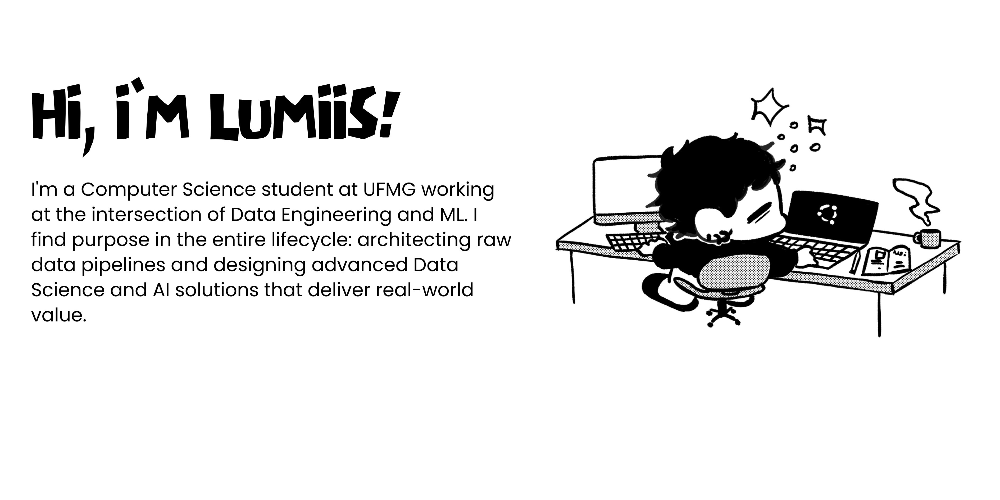

---

Hi there, I'm Luisa! I am a Computer Science student at UFMG (Brazil) currently working as a Data Engineer in the international tech industry. Alongside engineering, I serve as a Data Science Mentor in a corporate residency program and develop applied research in Machine Learning, aiming to build data-driven architecture that powers state-of-the-art intelligent systems.

---

### Current Focus

* **AI Agents & LLMs:** Designing autonomous workflows, specializing in **LangGraph** and **RAG** architectures to build smart automation.
* **Creator Intelligence Studio:** Developing a Full-Stack SaaS that integrates social media APIs with AI-driven analytics for creators.
* **Applied Research:** A long journey in Deep Learning—from building Computer Vision models for geophysics to Music Information Retrieval (MIR). Currently exploring optimization and teaching Data Science.

---

### Tech Stack

**Data & Machine Learning** 

  
  
  
  
  
  

**Languages & Full Stack** 

  
  
  
  

---

### Fun Facts

**Artist:** Drawing and painting are my favorite ways to recharge.
**Animation:** Huge fan of Anime and Independent Animation (shoutout to Le Goblins).
**Reading:** Currently reading *Berserk*, *One Piece*, and *The Summer Hikaru Died*.
**Fitness:** Gym & Calisthenics enthusiast.
**Global Science:** Presented research in **South Korea** and **Chile**, and studied ML in **Serbia**.

---

### Let's Connect

