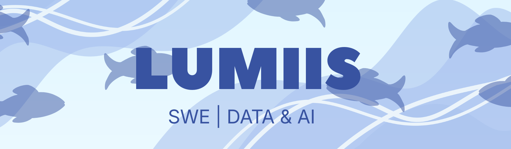

# Hi there, I'm Luisa!

### About Me
I'm a Computer Science student at UFMG (Brazil) passionate about the entire data lifecycle. I find purpose in everything from raw data transformation to advanced analytics and Data Science, building AI applications that turn complex datasets into real-world value. 

Currently, I work as a **Junior Data Engineer at KIS Solutions** and serve as a **Data Science Mentor** in the UFMG + Samarco residency program. My work bridges the gap between robust Data Engineering (Databricks, PySpark, Kafka) and cutting-edge AI, with a special interest in Data Science and AI-driven products.

---

### Current Focus
* **AI Agents:** Exploring strategic implementation of autonomous agents for automation and content workflows.
* **Creator Intelligence Studio:** Building a Full Stack SaaS for creators to unify analytics with AI-driven insights.
* **Applied Research:** I've had a long journey in Deep Learning, from the fundamentals to state-of-the-art models. I worked with Computer Vision for Petrobras research for 2.5 years and also in the Musical Information Retrieval field alongside my colleague Thiago Poppe. Right now, I'm exploring new themes and teaching Data Science in the Samarco residency program, solving optimization problems with Linear Programming and AI.
* **Art & Tech:** I've always been a traditional and digital artist. I believe creativity is the "secret sauce" that glues everything I am together.

---

### Tech Stack

| Category | Technologies |
| :--- | :--- |
| **Languages** | `Python`, `SQL`, `TypeScript`, `C++`, `Bash`, `C` |
| **Data Engineering** | `PySpark`, `Databricks`, `Kafka`, `PostgreSQL`, `ETL/ELT`, `Airflow` |
| **AI / Machine Learning** | `PyTorch`, `TensorFlow`, `Scikit-learn`, `Pandas`, `Transformers` |
| **Web / Full Stack** | `Next.js 15`, `React 18`, `Tailwind CSS`, `Drizzle ORM`, `Node.js` |

---

### About this GitHub
Think of this space as my digital laboratory. Here you’ll find:
* **Academic Repositories:** Algorithms, Computational Geometry, and Software Development from UFMG.
* **Exploratory Projects:** Experimental Machine Learning and AI agent scripts.
* **Useful Tools:** Personal automations and side projects in constant evolution.
> *This profile is a work in progress — my goal is to build a hub of useful, high-impact projects in the future.*

---

### Fun Facts
* **Artist:** Drawing and painting are my favorite ways to recharge.
* **Animation:** Huge fan of Anime and Independent Animation (shoutout to Le Goblins Animation University).
* **Reading:** I love Comics, Manga, and Manhwa. Currently reading *Berserk*, *One Piece*, and *The Summer Hikaru Died*.
* **Fitness:** Gym & Calisthenics enthusiast to keep the brain sharp.
* **Travel:** I've presented research in **South Korea** and **Chile**, and studied ML in **Serbia**.

---

### Let's Connect

> **P.S.:** My current profile picture is **Rebeca**, my dog! She's a mutt (*vira-lata*), and this is an old photo of her wearing the very first headset I ever owned. In the future, I'll replace it with one of my own drawings, but for now, this is a little tribute to her.

---

  

